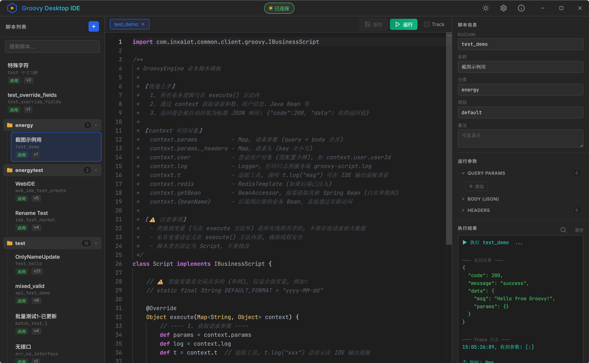

<div align="center">


# Groovy Desktop IDE

**基于 Tauri 2.0 + Rust 的跨平台 Groovy 动态脚本管理与调试工具**，需结合GroovyEngine框架（另开源项目）使用

[](https://v2.tauri.app/)
[](https://www.rust-lang.org/)
[](https://microsoft.github.io/monaco-editor/)
[](LICENSE)

原生桌面应用体验，直连 GroovyEngine 后端进行开发调试Groovy业务代码脚本。  
支持 Windows / macOS / Linux 三平台。

[功能特性](#-功能特性) · [下载安装](#-下载安装) · [从源码构建](#-从源码构建) · [架构设计](#-架构设计) · [开发指南](#-开发指南)

</div>

---

## 📸 界面预览



## ✨ 功能特性

### 🎯 核心功能

- **Monaco 代码编辑器** — 完整的 VS Code 编辑体验，支持 Groovy 语法高亮、括号匹配、多光标编辑
- **智能代码补全** — 自动从后端加载已注入的 Java Bean 方法签名，提供 ctx 上下文补全
- **脚本 CRUD** — 新建、编辑、保存、删除脚本，支持字段修改检测与脏状态提醒
- **在线测试运行** — 配置 Query Params / Body (JSON) / Headers，一键运行并查看格式化结果
- **Track 追踪模式** — 开启后可追踪脚本执行期间所有 Java Bean 调用链，包含方法名、参数、返回值和耗时
- **多标签页编辑** — 同时打开多个脚本，支持标签切换、关闭确认、滚动导航
- **脚本分类管理** — 按 category 自动分组折叠，支持实时搜索过滤

### 🖥️ 桌面专属特性

- **无 CORS 限制** — 通过 Rust 侧 HTTP 请求直连后端，无需代理和 CORS 配置
- **自定义标题栏** — 去除系统边框，自定义窗口控制按钮（最小化 / 最大化 / 关闭），主题色跟随深浅模式
- **拖拽窗口** — 标题栏区域支持原生拖拽移动
- **关于弹窗** — 显示版本信息和作者信息
- **免安装运行** — Windows 提供免安装 exe，macOS 提供 .app，Linux 提供 AppImage

### 🎨 界面设计

- **深色 / 浅色主题** — 一键切换，自动同步 Monaco 编辑器和系统窗口标题栏主题色
- **三栏布局** — 脚本列表 | 代码编辑器 | 信息面板，清晰的工作区划分
- **JetBrains Mono 字体** — 专业代码编辑字体
- **状态指示** — 连接状态实时显示，启用/禁用/版本号直观标注

### 🔒 安全机制

- **API Key 鉴权** — 所有请求通过 `X-Groovy-Token` 头验证身份
- **登录令牌透传** — 可选配置 `Authorization` 令牌，测试执行时获取真实用户上下文

## 📥 下载安装

| 平台          | 下载                                                                                                 | 说明                   |
| ----------- | -------------------------------------------------------------------------------------------------- | -------------------- |
| **Windows** | [Groovy Desktop IDE_x.x.x_x64-setup.exe](https://github.com/fengin/groovy-desktop-ide/releases)  | NSIS 安装包，或直接运行 `exe` |
| **macOS**   | [Groovy Desktop IDE_x.x.x_x64.dmg](https://github.com/fengin/groovy-desktop-ide/releases)        | 拖入 Applications 即可   |
| **Linux**   | [Groovy Desktop IDE_x.x.x_amd64.AppImage](https://github.com/fengin/groovy-desktop-ide/releases) | 直接运行，无需安装            |

> 下载后打开应用，点击右上角 ⚙️ 设置后端地址和 API Key 即可使用。  
> 桌面版可**直接填写后端真实地址**（如 `http://192.168.1.100:8025`），无需任何代理设置。

## 🏗 架构设计

Groovy Desktop IDE 是 **GroovyEngine 动态业务执行引擎** 的桌面开发工具，整体架构如下：


### IDE 在架构中的位置

```
   ┌──────────────────────────────────┐
   │    Groovy Desktop IDE            │  ◄── 本项目
   │    (Tauri 2.0 + Rust + WebView)  │
   │                                  │
   │  ┌─────────────┐  ┌───────────┐  │
   │  │ 前端 WebView │ │ Rust 后端  │  │
   │  │ (Monaco)    │──│ HTTP 插件  │  │
   │  └─────────────┘  └─────┬─────┘  │
   └──────────────────────────┼───────┘
                              │ HTTP (直连，无 CORS)
                              ▼
                   ┌───────────────────────┐
                   │   GroovyEngine 后端    │
                   │   管理 API + 调试 API  │
                   │   脚本管理器 + 执行引擎  │
                   └──────────┬────────────┘
                              │
                   ┌──────────┴────────────┐
                   │  MySQL / 脚本存储      │
                   │  Spring Beans         │
                   └───────────────────────┘
```

### 技术栈

| 层面          | 技术                | 版本    | 说明                     |
| ----------- | ----------------- | ----- | ---------------------- |
| **桌面框架**    | Tauri             | 2.10+ | Rust 后端 + 系统 WebView   |
| **后端运行时**   | Rust              | 1.93+ | 高性能、内存安全               |
| **HTTP 插件** | tauri-plugin-http | 2.x   | Rust 侧 HTTP 请求，绕过 CORS |
| **构建工具**    | Vite              | 6.x   | 前端构建                   |
| **代码编辑器**   | Monaco Editor     | 0.55  | VS Code 同款编辑器内核        |
| **前端**      | Vanilla JS + CSS  | —     | 零框架依赖                  |

### CORS 跨域解决方案

桌面应用打包后 WebView origin 为 `https://tauri.localhost`，直接使用浏览器 `fetch` 会遇到 CORS 跨域问题。

**核心方案**：使用 `tauri-plugin-http` 从 Rust 层发 HTTP 请求，完全绕过浏览器 CORS 限制。

| 场景       | 方案                | 请求链路                                  |
| -------- | ----------------- | ------------------------------------- |
| **开发模式** | Vite 代理（自动回退）     | JS → localhost:5174 → Vite proxy → 后端 |
| **打包发布** | **Tauri HTTP 插件** | JS → Rust fetch → 后端（无 CORS）          |

核心实现：`src/api.js` 中 `smartFetch()` 函数检测 `window.__TAURI_INTERNALS__`，智能选择：

- 检测到 Tauri → 使用 `@tauri-apps/plugin-http` 的 fetch
- 未检测到 → 回退到浏览器原生 fetch（开发模式走 Vite 代理）

## 🔧 从源码构建

### 环境要求

| 工具            | 版本    | 安装说明                                                      |
| ------------- | ----- | --------------------------------------------------------- |
| **Node.js**   | 18+   | https://nodejs.org/                                       |
| **Rust**      | 1.93+ | https://rustup.rs/                                        |
| **Tauri CLI** | 2.x   | 已在 devDependencies，无需单独安装                                 |
| **系统依赖**      | —     | [Tauri 系统依赖指南](https://v2.tauri.app/start/prerequisites/) |

### 开发模式

```bash
# 克隆项目
git clone https://github.com/fengin/groovy-desktop-ide.git
cd groovy-desktop-ide

# 安装前端依赖
npm install

# 启动开发模式（前端 + Rust 同时启动）
npm run tauri dev
```

> 首次启动需要编译 Rust 依赖，约需 2-3 分钟，后续增量编译仅需数秒。

### 构建发布包

```bash
# 构建当前平台安装包
npm run tauri build
```

构建产物位置：

- Windows: `src-tauri/target/release/bundle/nsis/`
- macOS: `src-tauri/target/release/bundle/dmg/`
- Linux: `src-tauri/target/release/bundle/appimage/`

## 📡 API 接口

IDE 通过 RESTful API 与 GroovyEngine 后端交互：

| 接口   | 方法     | 路径                                    | 说明                         |
| ---- | ------ | ------------------------------------- | -------------------------- |
| 脚本列表 | GET    | `/api/groovy/script/list`             | 支持 category/projectCode 筛选 |
| 脚本详情 | GET    | `/api/groovy/script/:id`              | 获取脚本完整信息                   |
| 创建脚本 | POST   | `/api/groovy/script`                  | 新建脚本                       |
| 更新脚本 | PUT    | `/api/groovy/script/:id`              | 保存修改                       |
| 删除脚本 | DELETE | `/api/groovy/script/:id`              | 删除脚本                       |
| 测试执行 | POST   | `/api/groovy/script/test`             | 测试运行（支持 track 模式）          |
| 代码补全 | GET    | `/api/groovy/script/completions`      | 获取 Bean 方法签名               |
| 刷新缓存 | POST   | `/api/groovy/script/refresh/:bizCode` | 刷新单个脚本缓存                   |
| 全量刷新 | POST   | `/api/groovy/script/refresh/all`      | 重载全部脚本                     |
| 批量部署 | POST   | `/api/groovy/script/deploy`           | 批量导入脚本                     |

所有接口需要携带 `X-Groovy-Token` 请求头进行鉴权。

## 📁 项目结构

```
groovy-desktop-ide/
├── index.html              # 主页面（三栏布局 + 自定义标题栏 + 窗口控制）
├── src/
│   ├── api.js              # API 封装层（smartFetch 自动选择请求方式）
│   ├── main.js             # 核心逻辑（编辑器、标签页、脚本管理、窗口控制）
│   └── style.css           # 完整样式系统（深色/浅色主题 + 窗口控制样式）
├── src-tauri/
│   ├── Cargo.toml          # Rust 依赖（含 tauri-plugin-http）
│   ├── tauri.conf.json     # Tauri 窗口配置（1400×900、无系统边框）
│   ├── src/
│   │   ├── main.rs         # Rust 主入口
│   │   └── lib.rs          # Tauri 应用初始化 + HTTP 插件注册
│   ├── capabilities/
│   │   └── default.json    # 权限配置（窗口控制、HTTP scope）
│   └── icons/              # 全平台应用图标
├── docs/
│   ├── architecture.png    # GroovyEngine 整体架构图
│   └── screenshot.png      # 界面截图
├── vite.config.js          # Vite 配置（Tauri 适配、dev proxy）
└── package.json            # 前端依赖管理
```

## ⚙️ 配置说明

### Tauri 窗口配置 (`src-tauri/tauri.conf.json`)

```json
{
  "app": {
    "windows": [{
      "title": "Groovy Desktop IDE",
      "decorations": false,       // 隐藏系统边框，使用自定义标题栏
      "width": 1400,
      "height": 900,
      "minWidth": 960,
      "minHeight": 600,
      "center": true
    }]
  }
}
```

### Vite 开发代理 (`vite.config.js`)

```js
proxy: {
  '/api/groovy': {
    target: 'http://localhost:8025',  // 修改为你的后端地址
    changeOrigin: true,
  },
}
```

## 🤝 相关项目

- **[Groovy Web IDE](https://github.com/fengin/groovy-web-ide)** — 浏览器版 IDE，功能一致，适合嵌入现有系统或无需安装的场景
- **GroovyEngine** — 后端 Groovy 动态业务执行引擎，提供脚本编译、缓存、执行和管理能力

## 📄 License

[MIT](LICENSE)

---

<div align="center">

**Made with ❤️ by [凌封](https://aibook.ren)**

</div>
